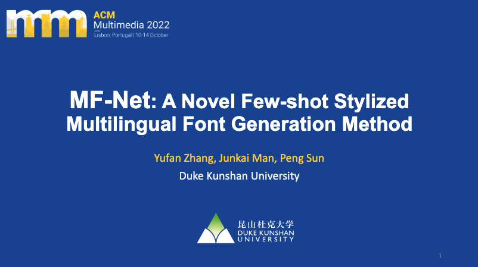

# MF-Net

**MF-Net: A Novel Few-shot Stylized Multilingual Font Generation Method**

Check out the paper on ACM Digital Library: [https://doi.org/10.1145/3503161.3548414](https://doi.org/10.1145/3503161.3548414)

- Authors: **[Yufan Zhang](https://yufanz.xyz), [Junkai Man](https://junkaiman.com) & [Peng Sun](https://scholars.duke.edu/person/Peng.Sun1)\***
- Paper presented at the 30th ACM International Conference on Multimedia ([ACM Multimedia 22](https://2022.acmmm.org/))

<!-- <video width="80%" poster="https://raw.githubusercontent.com/iamyufan/MF-Net/main/presentation/cover.png" controls>
   <source src="https://dl.acm.org/action/downloadSupplement?doi=10.1145%2F3503161.3548414&file=MM22-fp3115.mp4" type="video/mp4">
   Your browser does not support the video tag.
</video> -->

## Supplementary resources

Subjective evaluation survey - [Results](analysis/survey)

## Project gallery

### Network structure


### Results


## Presentation

Video presentation

[](https://youtu.be/YVkbaq7vZTA)

Video presentation - [Slides](presentation/slides.pdf)

Poster presentation - [Poster](presentation/poster.png)

## Cite us

```text
@inproceedings{10.1145/3503161.3548414,
   author = {Zhang, Yufan and Man, Junkai and Sun, Peng},
   title = {MF-Net: A Novel Few-Shot Stylized Multilingual Font Generation Method},
   year = {2022},
   isbn = {9781450392037},
   publisher = {Association for Computing Machinery},
   address = {New York, NY, USA},
   url = {https://doi.org/10.1145/3503161.3548414},
   doi = {10.1145/3503161.3548414},
   abstract = {Creating a complete stylized font library that helps the audience to perceive information from the text often requires years of study and proficiency in the use of many professional tools. Accordingly, automatic stylized font generation in a deep learning-based fashion is a desirable but challenging task that has attracted a lot of attention in recent years. This paper revisits the state-of-the-art methods for stylized font generation and presents a taxonomy of the deep learning-based stylized font generation. Despite the notable performance of the existing models, stylized multilingual font generation, the task of applying specific font style to diverse characters in multiple languages has never been reported to be addressed. An efficient and economical method for stylized multilingual font generation is essential in numerous application scenarios that require communication with international audiences. We propose a solution for few-shot multilingual stylized font generation by a fast feed-forward network, Multilingual Font Generation Network (MF-Net), which can transfer previously unseen font styles from a few samples to characters from previously unseen languages. Following the Generative Adversarial Network (GAN) framework, MF-Net adopts two separate encoders in the generator to decouple a font image's content and style information. We adopt an attention module in the style encoder to extract both shallow and deep style features. Moreover, we also design a novel language complexity-aware skip connection to adaptive adjust the structural information to be preserved. With an effective loss function to improve the visual quality of the generated font images, we show the effectiveness of the proposed MF-Net based on quantitative and subjective visual evaluation, and compare it with the existing models in the scenario of stylized multilingual font generation. The source code is available on https://github.com/iamyufan/MF-Net.},
   booktitle = {Proceedings of the 30th ACM International Conference on Multimedia},
   pages = {2088–2096},
   numpages = {9},
   keywords = {font design, image synthesis, few-shot learning, style transfer},
   location = {Lisboa, Portugal},
   series = {MM '22}
}
```

## Acknowledgements

Code derived and reshaped from [FTransGAN](https://github.com/ligoudaner377/font_translator_gan).
