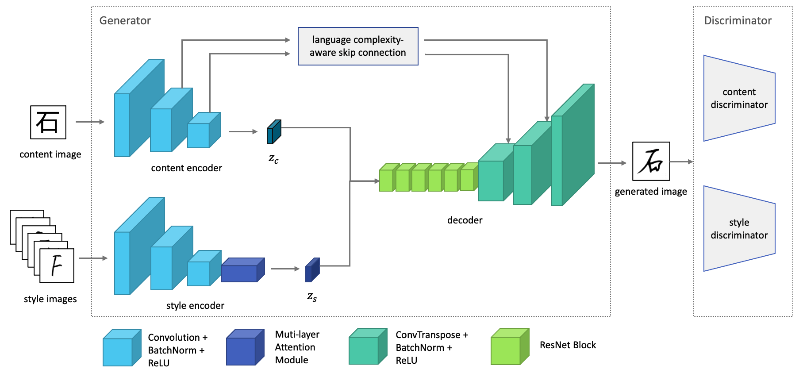
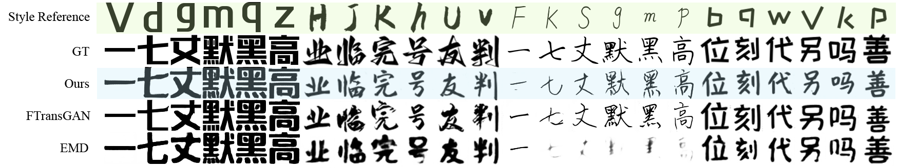
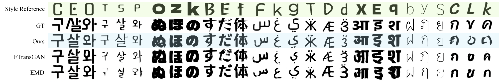

# MF-Net

**MF-Net: A Novel Few-shot Stylized Multilingual Font Generation Method**

[Accepted by ACM Multimedia 2022]

by [Yufan Zhang](https://yufanz.xyz), [Junkai Man](https://junkaiman.com) & [Peng Sun](https://scholars.duke.edu/person/Peng.Sun1)

## Supplementary resources

Subjective evaluation survey - [Results](analysis/survey)

## Gallery

## Acknowledgements

Code derived and reshaped from [FTransGAN](https://github.com/ligoudaner377/font_translator_gan).
